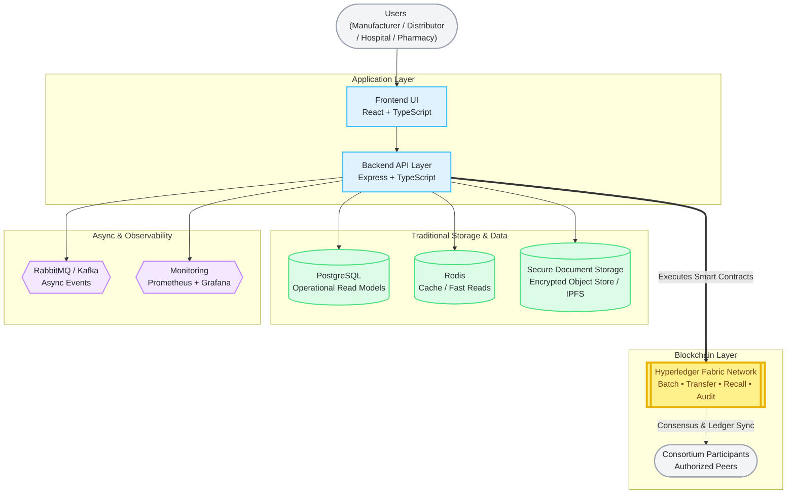
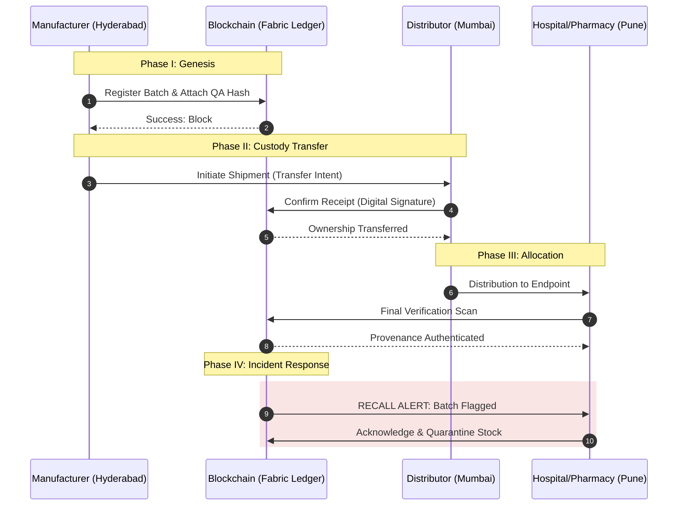

# SECURE CHAIN LEDGER
### **Enterprise-Grade Permissioned Blockchain for Pharmaceutical Traceability**
**Immutability • Consortium Consensus • Provenance • Compliance**

---

### TECHNICAL ARCHITECTURE STACK

| ARCHITECTURAL LAYER | CORE TECHNOLOGIES |
| :--- | :--- |
| **User Interface** |  |
| **Application Logic** |  |
| **Distributed Ledger** |  |
| **Systems & Storage** |  |

---

## EXECUTIVE OVERVIEW

**SecureChainLedger** is a sophisticated, permissioned blockchain ecosystem engineered to establish a decentralized "Single Source of Truth" within the pharmaceutical supply chain. By integrating an immutable audit trail with real-time operational visibility, the platform mitigates systemic risks associated with counterfeit penetration, inefficient recall protocols, and fragmented data silos.

Our architecture transforms critical supply chain friction into a **highly secure, tamper-proof, and privacy-preserving operational network**, ensuring the integrity of every pharmaceutical unit from point-of-origin to point-of-care.

---

### OPERATIONAL IMPACT

The current pharmaceutical landscape in the Indian subcontinent faces significant challenges regarding batch-level traceability and suspect-product infiltration. **SecureChainLedger** addresses these vulnerabilities by providing an unalterable chain-of-custody. This consortium-driven approach ensures that all participants—manufacturers, distributors, and healthcare providers—operate on a unified, high-fidelity data layer.

## Architecture Diagram

## The Team

| <a href="https://github.com/MARKASCHARAN"> <b>Marka Sai Charan</b></a> | <a href="https://github.com/KanishkaSingh-2004"> <b>Singh Kanishka</b></a> | <a href="https://github.com/your-username"> <b>Dasari Karthikeya</b></a> | <a href="https://github.com/your-username"> <b>N. Sumanjali</b></a> |
| :---: | :---: | :---: | :---: |
|  |  |  |  |

---

## STRATEGIC USE CASE: END-TO-END TRACEABILITY

The following scenario illustrates a real-world application of the SecureChainLedger protocol within the Indian pharmaceutical corridor, demonstrating the transition from manufacturing genesis to endpoint verification and incident response.

### SCENARIO: HYDERABAD-MUMBAI-PUNE CORRIDOR

| STAKEHOLDER | ACTION & LEDGER IMPACT |
| :--- | :--- |
| **Manufacturer (Hyderabad)** | Initializes **Batch-01**; commits manufacturing metadata and QA certification to the DLT. |
| **Logistics Partner** | Initiates physical transit; Smart Contract locks batch status to "In Transit." |
| **Distributor (Mumbai)** | Executes cryptographic receipt; the ledger updates custody ownership from Manufacturer to Distributor. |
| **Provider (Pune)** | Receives allocated stock at Hospital/Pharmacy; verifies provenance via the SecureChainLedger API. |
| **Regulator (CDSCO)** | Monitors the entire movement lifecycle via a read-only authorized observer node. |

---

## TRANSACTIONAL SEQUENCE FLOW

This diagram illustrates the multi-party interaction and the sequential anchoring of data on the Distributed Ledger.

## Why This Project Matters in India

This project addresses a real national and industry-level need.

NITI Aayog’s blockchain strategy work documented a pharmaceutical supply chain pilot with Oracle, Apollo Hospitals, Strides, and GS1 aimed at reducing fake drugs and improving transparency. The Department of Pharmaceuticals also highlighted the importance of an IT-enabled logistics and supply-chain system for real-time medicine distribution to avoid stock-out situations

Fabric’s official documentation explicitly describes it as an **enterprise-grade permissioned distributed ledger**, and its architecture supports private data collections and permissioned membership services that are especially useful for regulated industries and competing businesses sharing a common network. 

##  The Trust Gap
| Feature | Traditional Siloed Systems | SecureChainLedger (Blockchain) |
| :--- | :--- | :--- |
| **Data Ownership** | Controlled by one entity | Shared by the Consortium |
| **Traceability** | Manual reconciliation (Emails/Paper) | Real-time immutable tracking |
| **Counterfeit Risk** | High (Easy to inject fake records) | Low (Cryptographically verified) |
| **Recalls** | Takes days/weeks to locate stock | Near-instant "Targeted Recall" |

## Problem Statement

As a result, the ecosystem faces:

- limited batch-level traceability  
- counterfeit and suspect-product risk  
- weak chain-of-custody proof  
- delayed recalls and investigations  
- fragmented compliance records  
- poor real-time stock visibility  
- dependence on siloed or manually reconciled systems  

Even a single mismatch in logistics data can delay critical medicine movement, weaken trust between supply-chain partners, and increase the risk of unsafe or unverified product flow.

---

## Proposed Solution

SecureChainLedger provides a **shared source of truth** for medicine batch movement across authorized organizations.

The platform records key supply-chain events such as:

- batch creation  
- QA approval references  
- distributor transfers  
- receipt confirmations  
- downstream allocations  
- pharmacy or hospital verification  
- recall notices  
- compliance and audit proofs  

Critical trust events are recorded on **Hyperledger Fabric**, while sensitive documents and operational metadata stay securely off-chain. This hybrid model matches Fabric’s enterprise design around permissioned membership, privacy, and confidential data sharing across regulated participants. :contentReference[oaicite:1]{index=1}

## CORE FUNCTIONAL CAPABILITIES

The SecureChainLedger platform is engineered with a modular feature set designed to enforce strict compliance and data integrity across the pharmaceutical lifecycle.

### FEATURE SPECIFICATIONS

| MODULE | FUNCTIONAL SCOPE |
| :--- | :--- |
| **Batch Genesis** | Immutable registration of product metadata, expiration chronologies, and secure document anchoring. |
| **Custody Protocol** | Cryptographic logging of every stakeholder transition to maintain an unbroken chain-of-custody. |
| **Verification Engine** | Real-time provenance authentication for authorized participants to validate batch legitimacy. |
| **Recall Orchestration** | Precision identification of downstream inventory holders with automated acknowledgement tracking. |
| **Audit Architecture** | Verifiable event logging for instantaneous regulatory reporting and forensic investigations. |
| **Inventory Intelligence** | High-fidelity visibility into stock movement with automated exception and anomaly detection. |
| **Identity & Access** | RBAC (Role-Based Access Control) integrated with permissioned membership services. |
| **Hybrid Throughput** | Optimized read-path architecture utilizing high-speed caches and secondary index models. |

---

## SYSTEM OPERATIONAL WORKFLOW

The following process flow outlines the lifecycle of a pharmaceutical asset within the SecureChainLedger ecosystem, from manufacturing genesis to endpoint verification.

### PHASE I: PROVENANCE ESTABLISHMENT
* **01 | BATCH REGISTRATION:** Manufacturer initializes the asset on the ledger. Metadata is hashed and anchored; heavy documentation is committed to off-chain encrypted storage.
* **02 | QA CERTIFICATION:** Quality Assurance protocols are finalized. A digital attestation is linked to the batch, clearing it for commercial distribution.

### PHASE II: LOGISTICS & CUSTODY
* **03 | CONTROLLED DISPATCH:** Smart contracts validate distributor credentials and batch status before authorizing the transfer of custody.
* **04 | RECEIPT VALIDATION:** Distributors execute a "Confirm Receipt" transaction. Any variance in quantity or condition is recorded as a permanent ledger exception.
* **05 | DOWNSTREAM ALLOCATION:** Assets are decentralized further into the network (Hospitals/Pharmacies), generating incremental custody events on the DLT.

### PHASE III: ENDPOINT & GOVERNANCE
* **06 | AUTHENTICATION:** Healthcare providers perform a final-mile scan. The system verifies the unbroken signature chain and batch expiry status.
* **07 | INCIDENT MANAGEMENT:** In the event of a quality alert, the system performs a reverse-trace to notify all current holders and logs all corrective actions in the audit trail.

---

